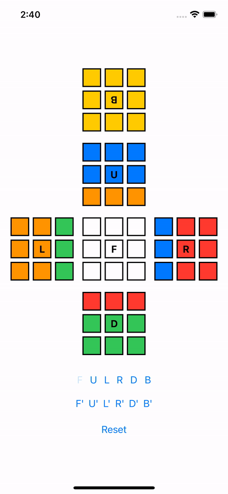
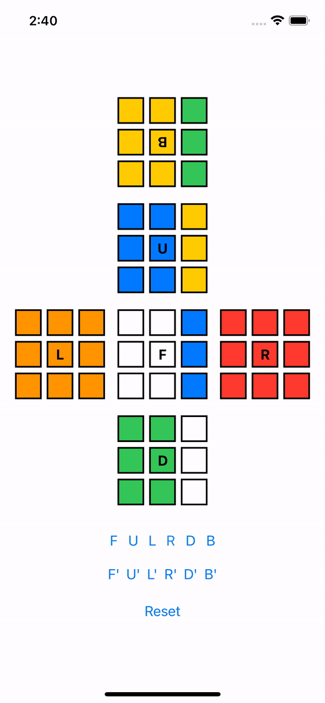

&copy; [Reese Barnett](https://www.linkedin.com/in/reesebarnett2024)

# Rubik's Cube Simulator (Native iOS Application)

<p align ="center">
 
</p>

Welcome to the Rubik's Cube Simulator! Have you ever wanted to practice cube algorithms on the go? Well now you can. This application allows you to practice algorithms and discover new ones. This application uses the well known cube notation: F, U, L, R, D, B (front, upper, left, right, down, back respectively) and " ' " to denote counterclockwise or the lack there of to denote clockwise.

---

## Agile Development Methodology

The Rubik's Cube simulator is developed by a single developer, [Reese Barnett](https://www.linkedin.com/in/reesebarnett2024). Barnett is responsible for the _**UI/UX design**_, _**front-end code**_, and _**back-end code**_. This project uses an iterative development process called _**Agile**_ that allows Barnett to evolve requirements and solutions over the lifetime of the application.

- Developer(s): [Reese Barnett](https://www.linkedin.com/in/reesebarnett2024) (Full-Stack)
- Programming Technologie(s): Xcode, SwiftUI, iOS SDK, Git
- Language(s): Swift

---

## Backend Code

###### Tools: Swift, iOS SDK, Xcode, Git

The main functionality of this application relies on _**matrix transformations**_. Let _A_ be an _m x m_ matrix. The matrix transformation associated to _A_ is the transformation:
_T: R<sup>m</sup> &rarr; R<sup>m</sup>_ defined by _T(x)=Ax_.
This is the transformation that takes a vector _x_ in _R<sup>m</sup>_ to the vector _Ax_ in _R<sup>m</sup>_. ([Interactive Linear Algebra](https://textbooks.math.gatech.edu/ila/matrix-transformations.html))

```swift

for i in 0..<3 { // Iterates 3 times for the 3 connected cells shared by any two faces
    cube[right].cells[i][0].color = temp[rborder].cells[abs(delta-2)][abs(delta-i)].color
    cube[top].cells[2][i].color = temp[tborder].cells[abs(abs(delta-2)-i)][abs(delta-2)].color
    cube[left].cells[i][2].color = temp[lborder].cells[delta][abs(delta-i)].color
    cube[bottom].cells[0][i].color = temp[bborder].cells[abs(abs(delta-2)-i)][delta].color
}
```

Since cubes are three-dimensional the cube matrix is a three-dimensional matrix. While this can increase code complexity the dimensions of the cube are abstracted away. The matrix transformations are accomplished in `Cube.swift`. When performing a transformation, the current state of the cube is copied into a variable. This temporary variable undergoes the transformation and then the original matrix is updated.
